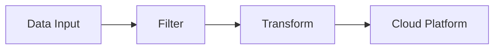

# Slidev Quick Reference Guide

## Feature Checklist

### Theming System
- [x] Custom color palettes (CSS variables)
- [x] Custom fonts including Inter
- [x] Dark theme support
- [x] Per-slide style overrides
- [x] Design system integration

### Layout Capabilities
- [x] 17 built-in layouts
- [x] Custom Vue component layouts
- [x] CSS Grid positioning
- [x] Flexbox support
- [x] Responsive design

### Advanced Features
- [x] Presenter notes (HTML comments)
- [x] Presenter mode with web interface
- [x] Mermaid diagrams (flowcharts, sequences, etc.)
- [x] Vue component integration
- [x] Click animations (v-click, v-after)
- [x] Motion effects (v-motion)
- [x] Live code editing (Monaco)
- [x] Drawing/annotation tools

### Content Organization
- [x] Multiple slide files (via `src` feature)
- [x] Slide reusability
- [x] Modular slide structure
- [x] Conditional rendering for variants
- [x] Component auto-import

### Styling
- [x] UnoCSS (Tailwind-compatible utilities)
- [x] Global styles
- [x] Scoped per-slide styles
- [x] CSS nesting support
- [x] Responsive utilities

### Export & Hosting
- [x] Export to PDF
- [x] Export to PPTX (with speaker notes)
- [x] Export to PNG
- [x] Build static SPA
- [x] Deploy to Netlify/Vercel/GitHub Pages

---

## Common Patterns

### Adding Speaker Notes
```markdown
# Slide Title

Visible content here

<!--
This is a speaker note visible only in presenter mode.
Key points to cover, timing, etc.
-->
```

### Creating Custom Layouts
```
layouts/
└── custom.vue

<template>
  <div class="slidev-layout custom">
    <slot name="header" />
    <slot />
    <slot name="footer" />
  </div>
</template>
```

### Using Click Animations
```markdown
<v-click>First element (click 1)</v-click>
<v-click>Second element (click 2)</v-click>
<v-clicks>
  - Item 1 (click 3)
  - Item 2 (click 4)
  - Item 3 (click 5)
</v-clicks>
```

### Using Motion Effects
```markdown
<div v-motion :initial="{ x: -80 }" :enter="{ x: 0 }">
  Animated element
</div>

<div v-motion :click-1="{ y: 30 }">
  Moves down on click 1
</div>
```

### Creating Reusable Components
```
components/
└── MetricCard.vue

<template>
  <div class="metric-card">
    <h3>{{ label }}</h3>
    <div class="value">{{ value }}</div>
  </div>
</template>

<script setup>
defineProps({ label: String, value: String })
</script>

<style scoped>
.metric-card {
  @apply p-4 rounded-lg bg-blue-500 text-white;
}
</style>
```

### Using Mermaid Diagrams
```markdown

```

### Modular Slide Organization
```markdown
---
theme: default
title: Presentation
---

# Title Slide

---
src: ./pages/section1.md
---

---
src: ./pages/section2.md
---
```

### Styling with UnoCSS
```markdown
---
layout: default
---

# Styled Content

<div class="grid grid-cols-2 gap-8">
  <div class="bg-blue-500 p-4 rounded-lg">Left</div>
  <div class="bg-green-500 p-4 rounded-lg">Right</div>
</div>

<style scoped>
.custom {
  @apply text-xl font-bold text-white;
}
</style>
```

### Conditional Rendering for Personas
```vue
<template v-if="audience === 'technical'">
  <div class="technical-content">
    Deep technical details
  </div>
</template>
<template v-else>
  <div class="executive-content">
    High-level summary
  </div>
</template>

<script setup>
const audience = 'technical' // or 'executive'
</script>
```

---

## Configuration File Examples

### uno.config.ts
```typescript
import { defineConfig } from 'unocss'

export default defineConfig({
  theme: {
    colors: {
      'expanso-dark': '#1a2332',
      'expanso-green': '#48BB78',
      'expanso-blue': '#4299e1',
      'expanso-red': '#fc8181',
    }
  },
  shortcuts: {
    'btn-primary': 'px-4 py-2 rounded-lg bg-expanso-green text-white',
    'metric-card': 'p-4 rounded-lg border border-gray-200',
  }
})
```

### Frontmatter Configuration
```yaml
---
theme: default
title: My Presentation
author: Name
date: 2025-10-27
fonts:
  sans: 'Inter'
  mono: 'Fira Code'
export:
  format: 'pdf'
  withClicks: true
highlighter: shiki
themeConfig:
  primary: '#48BB78'
  secondary: '#CBD5E0'
  background: '#1a2332'
---
```

---

## Keyboard Shortcuts & Navigation

| Key | Action |
|-----|--------|
| `→` or `Space` | Next slide |
| `←` | Previous slide |
| `↑` / `↓` | Navigate clicks |
| `F` | Fullscreen |
| `P` | Presenter mode |
| `O` | Overview mode |
| `B` | Blank screen |
| `G` | Go to slide |
| `D` | Dark mode toggle |

---

## Built-in Components

| Component | Purpose | Example |
|-----------|---------|---------|
| `<v-click>` | Reveal on click | `<v-click>Content</v-click>` |
| `<v-clicks>` | Batch click children | `<v-clicks><ul>...</ul></v-clicks>` |
| `<v-after>` | Show after previous | `<v-after>Next</v-after>` |
| `<v-motion>` | Motion animations | `<v-motion :click-1="{}">` |
| `<LightOrDark>` | Light/dark toggle | Auto dark mode |
| `<SlidevVideo>` | Video embed | `<SlidevVideo src="..."/>` |
| `<AutoFitText>` | Auto-fitting text | `<AutoFitText min="12" max="48">` |
| `<Arrow>` | Annotation arrow | `<Arrow x1="0" y1="0" x2="100" y2="100">` |

---

## Directory Structure Template

```
slidev-project/
├── slides.md                  # Main entry point
├── uno.config.ts             # UnoCSS configuration
├── vite.config.ts            # Build configuration
├── package.json
│
├── pages/                    # Modular slide sections
│   ├── 00-cover.md
│   ├── 01-intro.md
│   └── ...
│
├── layouts/                  # Custom layouts
│   ├── title.vue
│   ├── section.vue
│   └── ...
│
├── components/               # Reusable Vue components
│   ├── MetricCard.vue
│   ├── CodeBlock.vue
│   └── ...
│
├── styles/                   # Global styles
│   ├── main.css
│   ├── colors.css
│   └── typography.css
│
├── public/                   # Static assets
│   ├── logos/
│   ├── images/
│   └── videos/
│
└── dist/                     # Build output (generated)
```

---

## Common Commands

```bash
# Create new project
npm create slidev@latest my-presentation

# Development server with hot reload
slidev slides.md

# Presenter mode
slidev slides.md --presenter

# Export to PDF
slidev export slides.md --format pdf

# Export to PPTX
slidev export slides.md --format pptx

# Export to PNG
slidev export slides.md --format png

# Build static SPA
slidev build slides.md

# Build with PDF generation
slidev build slides.md --with-pdf
```

---

## Limitations Summary

| Feature | Status | Notes |
|---------|--------|-------|
| Drag-drop visual editor | ❌ No | Code-based only |
| WYSIWYG design | ❌ No | Markdown/Vue editing |
| Pixel-perfect alignment UI | ❌ No | CSS positioning only |
| Mermaid step reveals | ❌ No | Multiple diagrams workaround |
| Relative asset paths | ⚠️ Limited | Use public/ folder |
| Offline presentation | ⚠️ Limited | Requires browser |
| PPTX text selectable | ❌ No | Exports as images |

---

## Migration Checklist from Figma JSON

- [ ] Set up Slidev project with custom theme
- [ ] Match brand colors (Inter font, Expanso palette)
- [ ] Create reusable Vue components (MetricCard, LogoGrid, etc.)
- [ ] Convert slide content to markdown files
- [ ] Map `presentation_notes` to HTML comments
- [ ] Create custom layouts for unique slide designs
- [ ] Implement animations with v-click/v-motion
- [ ] Set up UnoCSS configuration
- [ ] Test responsive design on various screens
- [ ] Create presenter mode flow
- [ ] Test PDF/PPTX exports
- [ ] Deploy static SPA to hosting platform
- [ ] Train team on Markdown + Vue basics
- [ ] Establish git workflow for slide updates

---

## Resources

**Documentation:** https://sli.dev/
**GitHub:** https://github.com/slidevjs/slidev
**Community:** Discord, GitHub Discussions
**Themes:** https://sli.dev/resources/theme-gallery
**Addons:** https://sli.dev/resources/addon-gallery

---

## Tips & Best Practices

1. **Start Simple** - Begin with basic layouts, add complexity gradually
2. **Modularize** - Split slides into multiple files for easier maintenance
3. **Reusable Components** - Create components library matching your design system
4. **Test Exports** - Export frequently during development to catch issues
5. **Version Control** - Markdown + git = perfect for collaboration
6. **Speaker Notes** - Add comprehensive notes for delivery consistency
7. **Test Presenter Mode** - Practice with the web-based presenter interface
8. **Mobile Review** - Test on tablet/phone for responsive design
9. **Asset Optimization** - Minimize file sizes for faster delivery
10. **Documentation** - Keep style guide for consistency across decks

---

**Quick Reference Version:** 1.0
**Last Updated:** October 27, 2025
